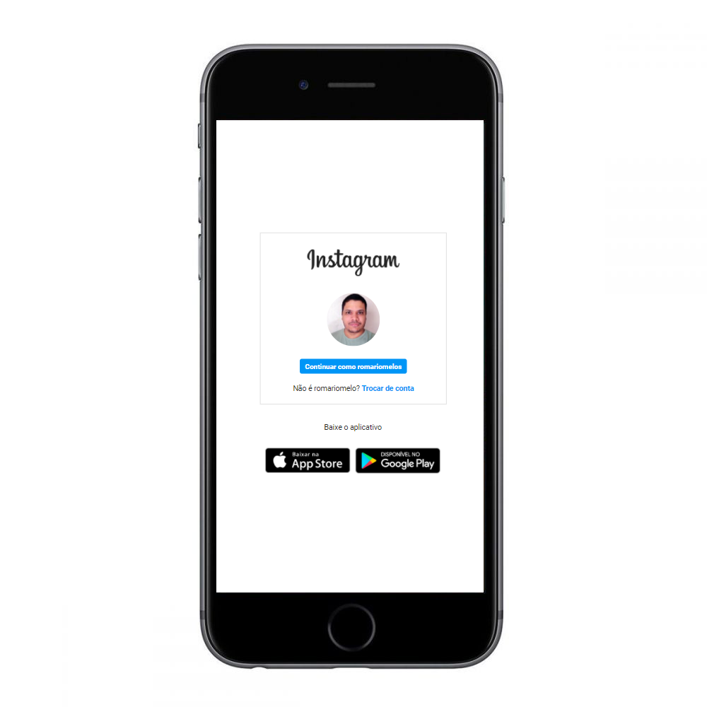
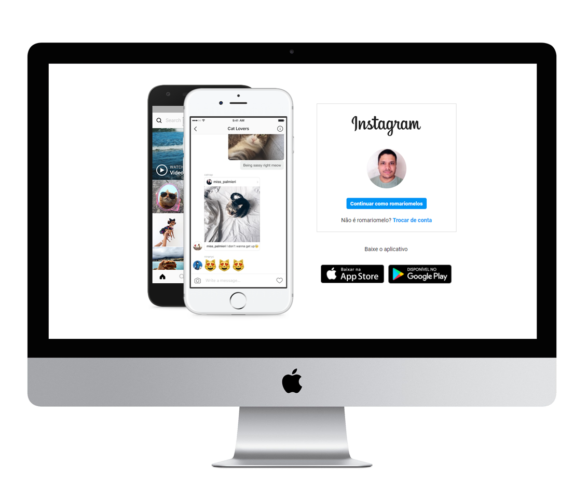

# Recriando a página inicial do Instagram

## Bootcamp HTML Web Developer - Digital Innovation One

### 🚀 Tecnologias utilizadas:
 
- HTML 5
- CSS 3

### 📧 Contato:

 

### 👩‍💻 Agredecimentos: 

[Gabriela Pinheiro](https://github.com/SpruceGabriela)

[Digital Innovation One](https://digitalinnovation.one)

### 💻 Screenshots 

Versão para Smatphone:

Versão para desktop
